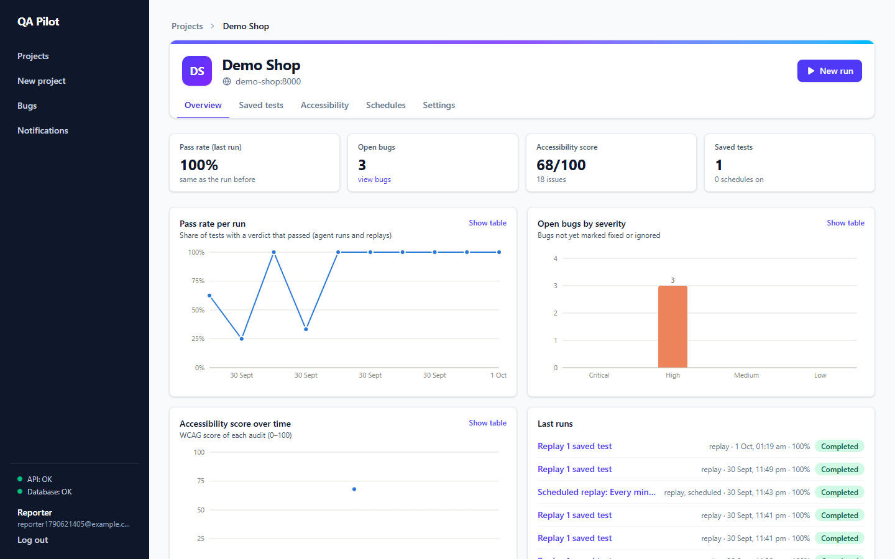
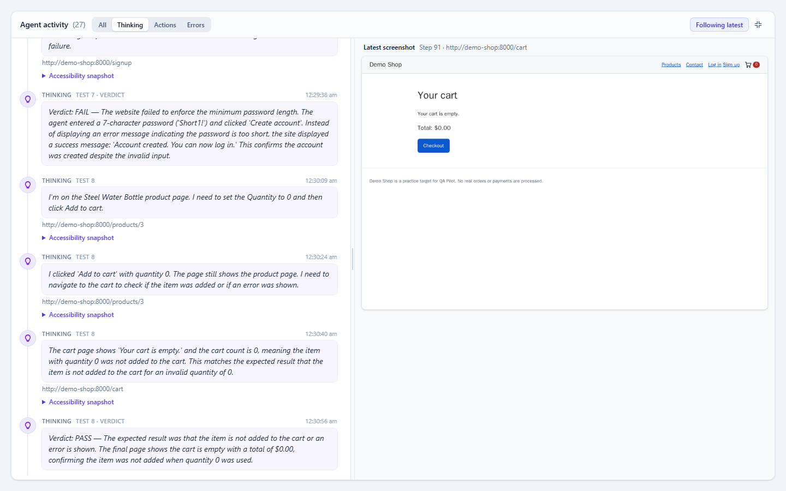
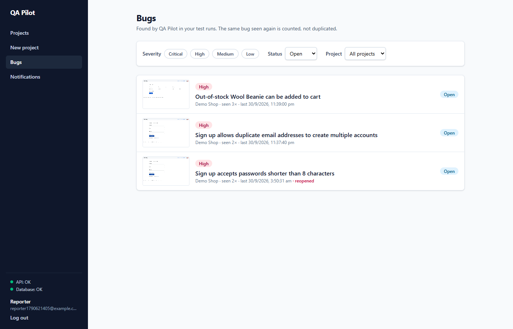
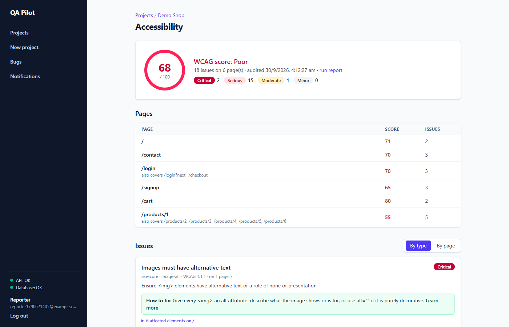
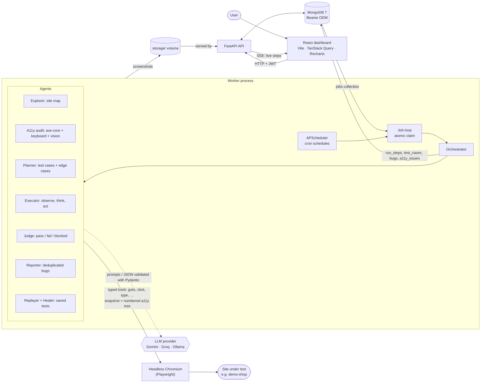

# QA Pilot

**An autonomous QA engineer for teams that don't have one.** Add your website, describe what to test in plain
English ("test signup, login and add-to-cart"), and AI agents open a real browser, explore the site, plan test
cases (including edge cases), run them, judge the results, report bugs with screenshots and reproduction steps,
and audit accessibility (WCAG). You watch the run live. Passing tests are saved, re-run on a schedule, and heal
themselves when the UI changes.

Final-year CSE project. The full brief is in [`claude.md`](claude.md).

## Try it live

| | Link | |
|---|---|---|
| **QA Pilot** | **https://qapilot-172-198-59-99.sslip.io** | Create a free account, then add a project |
| **Demo shop** | **https://shop-172-198-59-99.sslip.io** | A deliberately buggy shop to test. Use this as the project's base URL |

1. Open QA Pilot and **create an account**.
2. **Add a project** with the base URL `https://shop-172-198-59-99.sslip.io/`.
3. **Start a run**, e.g. "test signup and adding a product to the cart", and watch the agents work live.
   They find planted bugs such as the out-of-stock item that can still be added to the cart.

The public server shares a free AI quota, so each account gets 2 AI runs a day (max 6 tests per run). Replays of
saved tests are unlimited. If the link doesn't load, the server may be paused to save credits; try again later.

| Project overview | Live run |
|---|---|
|  |  |
| **Bugs** | **Accessibility audit** |
|  |  |

More screenshots in [`docs/screenshots/`](docs/screenshots): projects, run report, bug detail, saved tests.

## Architecture



How a run flows: the API stores the run and a `jobs` document. The worker claims the job with
`find_one_and_update` and runs **explore → accessibility audit → plan → (execute → judge → report) per test case**.
It saves every thought, action and observation as a `run_steps` document, which the API streams to the dashboard
over Server-Sent Events. Agents only touch the browser through a small typed tool set, and they see a compact,
numbered accessibility tree rather than raw HTML. Test-site passwords reach the browser as placeholders that are
filled in at the last moment, so the LLM never sees them.

## Quick start (Docker)

Requires Docker Desktop (on Windows, with WSL 2).

1. **Configure.** Copy the template and edit it:
   ```sh
   cp .env.example .env
   ```
   - `JWT_SECRET`: any long random string, e.g. `python -c "import secrets; print(secrets.token_urlsafe(48))"`.
   - `CREDENTIALS_KEY`: a Fernet key (the command is in `.env.example`) for encrypting test-site logins.
   - An LLM. Pick one:
     - **Groq** (free tier, fast): `LLM_PROVIDER=groq`, `GROQ_API_KEY=…` from console.groq.com. The free tier
       allows about 8k tokens a minute and 200k a day, roughly 3–4 full runs. Set `LLM_MIN_INTERVAL_SECONDS=15`.
     - **Gemini**: `LLM_PROVIDER=gemini`, `GEMINI_API_KEY=…` from aistudio.google.com. The free tier has a small
       daily request quota.
     - **Ollama** (local, no key): `LLM_PROVIDER=ollama` and a vision model, e.g.
       `ollama pull llama3.2-vision`.
   - **Automatic switching:** set `LLM_FALLBACKS` (e.g. `gemini`) to backup providers. When one runs out of
     tokens (daily quota, or still rate-limited after retries), the run continues on the next, and the live
     feed shows the switch. The exhausted provider is tried again an hour later.
2. **Start the stack.**
   ```sh
   docker compose up -d --build
   ```
   The first build downloads the Playwright image (~2 GB). `docker compose ps` should show five services.
   The API and worker wait for MongoDB's healthcheck.
3. **Open http://localhost:5173** and create an account. The sidebar should show *API: OK* and *Database: OK*.
4. **Add a project.** Name `Demo Shop`, URL **`http://demo-shop:8000`** (the Docker network name the worker
   uses; `localhost:8080` only works from your own browser), and tick "I own this site or am authorised to test
   it". Optional: under *Settings → Test credentials*, add `demo@shop.test` / `demo1234` so the agents can log in.
5. **Start a run.** *New run*, e.g. "test signup, login and cart", then watch the live feed. When it finishes,
   open the report, the Bugs page and the Accessibility page, then save or replay the passing tests.

| Service   | URL                          | Notes                                   |
|-----------|------------------------------|-----------------------------------------|
| frontend  | http://localhost:5173        | Dashboard                               |
| api       | http://localhost:8000/health | FastAPI; interactive docs at `/docs`    |
| worker    | —                            | `docker compose logs -f worker`         |
| mongo     | mongodb://localhost:27017    | Browse with MongoDB Compass             |
| demo-shop | http://localhost:8080        | Buggy test shop, see `demo-shop/GROUND_TRUTH.md`; `POST /reset` restores it |

MongoDB data lives in the `mongo-data` volume and screenshots in `qapilot-files` (shared by api and
worker). Beanie creates collections and indexes on startup, so there are no migrations: add a model to
`backend/app/models/` and list it in `DOCUMENT_MODELS`.

**Troubleshooting**
- *The page is blank or a module is missing after `npm install`:* the frontend container keeps its own
  `node_modules`. Recreate it with `docker compose up -d --build -V frontend`.
- *The run fails with "quota is used up":* the LLM's free-tier daily limit was reached. Wait for it to reset,
  or switch `LLM_PROVIDER`.
- *The run fails with "could not open the site":* use the Docker network name (`http://demo-shop:8000`), not
  `localhost`.


## Deploy (free, always on)

[`deploy/README.md`](deploy/README.md) deploys the whole stack to a free Oracle Cloud server, with HTTPS links for
QA Pilot and the demo shop. It takes one command from your PC: `bash deploy/push.sh ubuntu@<server-ip> <ssh-key>`.
The production setup (`docker-compose.prod.yml`) serves a built frontend through Caddy, exposes nothing but ports
80/443, and turns on public-server limits (daily AI runs, invite code, demo-shop safeguards).

## Run without Docker

You need Python 3.11, Node 22 and MongoDB 7 (easiest: `docker compose up -d mongo`).

```sh
# backend
cd backend
python -m venv .venv
.venv/Scripts/activate            # Windows; use `source .venv/bin/activate` on macOS/Linux
pip install -r requirements-dev.txt
export MONGO_URL=mongodb://localhost:27017
uvicorn app.main:app --reload     # API on :8000
python -m worker.main             # in a second terminal

# frontend
cd frontend
npm install
npm run dev                       # http://localhost:5173, proxies /api -> :8000
```

## Tests

```sh
cd backend && pytest     # needs MongoDB: docker compose up -d mongo (each test uses a throwaway database)
cd frontend && npm test
cd demo-shop && pytest    # also checks the planted bugs are still present
python -m pytest eval     # ground-truth matching rules of the benchmark
```

Browser tests use Playwright's bundled Chromium (always there in the worker container). Outside Docker, set
`BROWSER_CHANNEL=msedge` or `chrome` to use an installed browser; without one they are skipped. LLM calls are
always mocked in tests.

## Accounts and projects

Open http://localhost:5173, create an account, then add a project (name, base URL, and the
"I own this site or am authorised to test it" checkbox). API docs: http://localhost:8000/docs.

- Auth: `POST /auth/register`, `POST /auth/login` → access token (15 min) + refresh token (7 days);
  `POST /auth/refresh`; `GET /auth/me`. Send `Authorization: Bearer <access token>`.
- Projects: `GET/POST /projects`, `GET/PATCH/DELETE /projects/{id}`, and
  `/projects/{id}/credentials` for test-site logins. Users only ever see their own projects;
  anyone else's project returns 404.
- Test-site passwords are encrypted with `CREDENTIALS_KEY` (Fernet) and are never returned by the API.
  Set `JWT_SECRET` and `CREDENTIALS_KEY` in `.env` (see `.env.example`). Changing `CREDENTIALS_KEY`
  makes saved credentials unreadable.

To test the demo shop from the worker, use the base URL `http://demo-shop:8000` (the Docker network name).
`http://localhost:8080` only works from your own browser.

## Test runs

On the Projects page click **New run**, describe what to test in plain English (e.g. "test signup, login and
cart") and start it. If the flows need an account, add a test login under the project's **Test credentials**
first. The run page shows the test cases with live verdicts, the step feed (thoughts, actions, observations)
and the latest screenshot. Click a test case to see only its steps.

Click a project's name to open its **overview**: pass rate per run (agent runs and replays), open bugs by
severity, accessibility score over time and the last runs. Each chart can be switched to a table
(`GET /projects/{id}/overview`).

What happens in the worker (`backend/worker/`):

1. **Explorer** (`agents/explorer.py`, no LLM): follows same-origin links (depth 2, max 12 pages) and builds a
   site map of pages, forms, fields, buttons and links. It never submits forms.
2. **Planner** (`agents/planner.py`): one LLM call turns your goal + the site map into up to *max tests*
   test cases: happy paths plus edge cases (empty fields, invalid input, boundary numbers, duplicate actions,
   back button).
3. **Executor** (`agents/executor.py`): for each test case, in a fresh browser context, an observe → think → act
   loop: snapshot → the LLM picks one tool call → the browser runs it → the step (thought, action, screenshot)
   is saved and streamed. Max 25 steps / 5 minutes per test.
4. **Judge** (`agents/judge.py`): looks at the final snapshot **and screenshot** and decides
   pass / fail / blocked with a reason.
5. **Reporter** (`agents/reporter.py`): for every failed test, writes a bug (title, severity
   critical/high/medium/low, steps to reproduce, expected vs actual, screenshot, suggested fix) and checks it
   against the project's existing bugs: the same problem seen again is merged into the existing bug (occurrence
   count, runs), a bug marked *fixed* that shows up again is reopened, an *ignored* bug stays ignored.

**Accessibility audit** (New run option, on by default; `worker/audits/accessibility.py`): right after exploring,
each page *template* is audited once (`/products/1` … `/products/6` count as one):
axe-core WCAG 2.x A/AA rules; a real **keyboard-only walk** (Tab through the page, recording the focus order,
whether each focused element visibly changes, keyboard traps and controls never reached), reviewed by the LLM
only when it finds candidate problems; and an **alt-text quality** check that sends each image with its alt
text to the vision model. Each page gets a WCAG score out of 100 (−15 critical, −10 serious, −5 moderate,
−2 minor per rule, +1 per extra affected element, max +4), the site score is the average. The project's
**Accessibility** page shows the score and trend, pages, and issues grouped by type or by page with how-to-fix
guidance. If the LLM quota runs out, the audit continues with axe-core and the raw keyboard findings.

**Saved tests and self-healing.** Every test that passes is saved (project → **Saved tests**) as a replayable step
list. For each element it records several locators: role + name, visible text, CSS and position. **Replay** runs the
steps without the LLM (seconds instead of minutes). If a step's element is gone, the other locators are tried — a
fallback only counts if it is the same kind of element with a similar name — and if they all fail the **Healer**
agent picks the matching element from a page snapshot (e.g. "Create account" renamed to "Register"). The step is
repaired, the replay continues, and the repair is recorded in the test's **heal history**. **Export as Playwright
script** downloads a `@playwright/test` spec (test logins become `QA_CRED_…` environment variables, the site is
`QA_BASE_URL`).

Demo: `curl -X POST http://localhost:8080/admin/ui-variant -H "Content-Type: application/json" -d '{"variant":"v2"}'`
renames buttons and labels in the demo shop; replaying then heals the saved tests. `POST /reset` switches back.

**Schedules** (project → **Schedules**): cron schedules run by APScheduler inside the worker (synced from MongoDB
every 30 s) replay the project's saved tests. If a saved test that passed before fails, you get an in-app
**notification** (sidebar → Notifications); no email is sent.

After a run, **View report** shows the summary, every test with its verdict, the agent log and the final
screenshot, and the bugs found. **Download report** saves one self-contained HTML file (screenshots embedded,
no external links); open it in a browser and use *Print → Save as PDF* for a PDF.
The **Bugs** page lists bugs across all your projects (filter by severity, status, project); open one to mark it
fixed, ignored or open again.

Prompts are in `backend/worker/agents/prompts/*.md`. Test logins only ever reach the LLM as placeholders like
`{{cred:Test shopper:password}}`; the browser fills in the real value. The LLM is chosen with `LLM_PROVIDER`
(default Gemini, model `GEMINI_MODEL`), rate-limited by `LLM_MIN_INTERVAL_SECONDS` with retries on HTTP 429.

API: `POST /projects/{id}/runs` (one active run per project), `GET /runs/{id}`, `/runs/{id}/test-cases`,
`/runs/{id}/report.html`, `GET /bugs?severity=&status=&project_id=&run_id=`, `GET/PATCH /bugs/{id}`,
`GET /projects/{id}/accessibility[?run_id=]`, `GET /projects/{id}/saved-tests`, `POST /projects/{id}/replays`,
`GET /saved-tests/{id}/export.spec.ts`, `GET/POST /projects/{id}/schedules`, `PATCH/DELETE /schedules/{id}`, `GET /notifications`,
`/runs/{id}/steps`, `/runs/{id}/steps/{index}/screenshot`, and `GET /runs/{id}/stream` (Server-Sent Events:
`run`, `test_case`, `step`, `end`; resume with `?after=<last step index>`).

Browser tests need a browser. They run in the worker container (`docker compose exec worker pytest`); on
Windows use your installed Edge: `$env:BROWSER_CHANNEL="msedge"; .venvScriptspython -m pytest`.

## Demo shop

`demo-shop/` is a small FastAPI + plain HTML/JS shop with 15 planted functional bugs and
10 accessibility violations (listed in `demo-shop/GROUND_TRUTH.md`). It's QA Pilot's test target.

- Reset the data before a run: `curl -X POST http://localhost:8080/reset`
- Seed login: `demo@shop.test` / `demo1234`
- Prove every planted defect still exists (Playwright + axe-core, prints ID / name / CONFIRMED or MISSING):
  ```powershell
  cd demo-shop
  py -3.11 -m venv .venv                                  # once
  .venv\Scripts\python -m pip install -r requirements-verify.txt   # once
  $env:BROWSER_CHANNEL = "msedge"                         # use installed Edge (or: .venv\Scripts\playwright install chromium)
  .venv\Scripts\python verify_bugs.py
  ```
- Rename buttons and labels (self-healing demo):
  `curl -X POST http://localhost:8080/admin/ui-variant -H "Content-Type: application/json" -d '{"variant":"v2"}'`

## Evaluation

`eval/` benchmarks QA Pilot against demo-shop's planted bugs (`demo-shop/GROUND_TRUTH.md`: 15 functional bugs,
10 accessibility violations). Each run resets the shop, creates a fresh project and runs the full pipeline.
Findings are then matched to the ground truth: functional bugs with per-bug keyword rules
(`eval/matching.py`), accessibility issues by rule id and page.

```sh
docker compose up -d
backend/.venv/Scripts/python eval/run_eval.py                  # 3 runs (default), ~15-25 min each on Groq's free tier
backend/.venv/Scripts/python eval/run_eval.py --runs 1 --max-tests 6
backend/.venv/Scripts/python eval/run_eval.py --rescore eval/results/<file>.json   # re-score saved data, no LLM
backend/.venv/Scripts/python -m pytest eval                    # tests for the matching rules
```

The script writes `eval/results/eval-<date>.json` (raw findings plus scores) and a `.md` table. The table has
recall, precision, average time per run, LLM calls and tokens, and **QA Pilot vs. axe-core alone** for
accessibility. The axe-only baseline is axe's findings on the same pages; QA Pilot adds the keyboard walk and the
vision alt-text check. Runs that fail (for example on an LLM quota) are left out of the scores, and the script
stops early when the LLM quota runs out.

## Security

- Every API route except register/login requires a JWT. Users only see their own projects; anything else
  returns 404. Repeated failed logins for an account are locked out for 15 minutes (HTTP 429).
- Test-site passwords are Fernet-encrypted at rest and never returned by the API. The LLM, logs, saved steps
  and exported scripts only ever see `{{cred:Label:password}}` placeholders.
- **SSRF guard:** a project URL can't point at QA Pilot's own services (`mongo`, `api`, …) or at
  link-local/metadata addresses such as `169.254.169.254`. The browser also blocks such requests if a
  redirect or the site's own scripts try them (`BLOCKED_TARGET_HOSTS` in `.env`). `localhost` and LAN
  addresses stay allowed so you can test apps running on your machine.
- The agent can only navigate within the project's origin. It never submits payments, and it stops with
  *blocked: needs human* at payment, OTP or CAPTCHA steps. Security probes (XSS/SQLi strings) are off unless
  the owner marks the site as their own and enables them.
- Exported Playwright scripts escape all LLM-written text, so a test title or note can't inject code into a
  file you run.
- Never commit `.env`; `.env.example` holds placeholders only.
